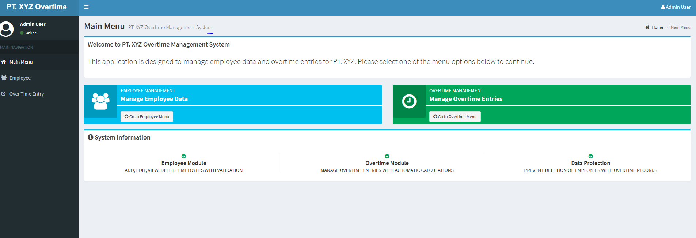

# PT. XYZ Overtime Management System

A comprehensive C# MVC 5 application for managing employee data and overtime entries, built with Entity Framework 6, Bootstrap 3, jQuery, and AdminLTE v2.

## 📋 Table of Contents
- [Features](#features)
- [Technology Stack](#technology-stack)
- [Prerequisites](#prerequisites)
- [Installation](#installation)
- [Database Setup](#database-setup)
- [Project Structure](#project-structure)
- [Key Features Demonstration](#key-features-demonstration)
- [Usage Guide](#usage-guide)
- [Screenshots](#screenshots)

## ✨ Features

### Employee Management
- ✅ Add, Edit, View, and Delete employee records
- ✅ NIK (Employee ID) uniqueness validation with duplicate prevention
- ✅ Department association with foreign key relationships
- ✅ Position-based allowance management:
  - Laptop allowance available for Supervisor and Manager only
  - Meal allowance not available for Manager
- ✅ Employee deletion prevention if overtime records exist
- ✅ Pagination support for large datasets

### Overtime Entry Management
- ✅ Add, Edit, View, and Delete overtime entries
- ✅ DateTime picker integration for Time Start and Time Finish
- ✅ Automatic calculation of OT hours using JavaScript:
  - Actual OT Hours = Time Finish - Time Start
  - Calculated OT Hours = Actual OT Hours × 2
- ✅ Maximum 3 hours validation for Actual OT Hours
- ✅ Time overlap validation (Time Finish must be after Time Start)
- ✅ Read-only OT hours fields with automatic population
- ✅ Pagination support

### Technical Demonstrations
- ✅ **EF6 Raw SQL Queries**: Used in Employee and OverTime controllers for complex data retrieval
- ✅ **LINQ Method Syntax**: Used throughout for data manipulation and validation
- ✅ **ViewBag**: Demonstrated for passing department and employee data from controller to view
- ✅ **Razor Variables**: Used for position select items in Employee view
- ✅ **In-View Database Access**: AJAX calls to retrieve department data dynamically
- ✅ **jQuery DOM Manipulation**: Extensive use for form handling, validation, and UI updates
- ✅ **Modal Dialogs**: Bootstrap modals for Add/Edit operations
- ✅ **AdminLTE v2**: Professional admin dashboard template integration

## 🛠 Technology Stack

- **Framework**: ASP.NET MVC 5 (.NET Framework 4.6.1)
- **ORM**: Entity Framework 6.4.4
- **Database**: Microsoft SQL Server Express
- **Frontend**: 
  - Bootstrap 3.3.7
  - jQuery 3.2.1
  - Font Awesome 4.7.0
  - AdminLTE 2.4.18
  - Bootstrap DateTimePicker 4.17.47
  - Moment.js 2.29.1

## 📦 Prerequisites

Before you begin, ensure you have the following installed:

1. **Visual Studio 2017 or later** (Community, Professional, or Enterprise)
   - ASP.NET and web development workload
   - .NET Framework 4.6.1 SDK

2. **Microsoft SQL Server Express 2016 or later**
   - Download from: https://www.microsoft.com/en-us/sql-server/sql-server-downloads

3. **SQL Server Management Studio (SSMS)** (Optional but recommended)
   - Download from: https://docs.microsoft.com/en-us/sql/ssms/download-sql-server-management-studio-ssms

4. **IIS Express** (Usually included with Visual Studio)

## 🚀 Installation

### Step 1: Clone or Extract the Project

```bash
# If using Git
git clone <repository-url>

# Or extract the ZIP file to your desired location
```

### Step 2: Open the Project in Visual Studio

1. Open Visual Studio
2. Click **File > Open > Project/Solution**
3. Navigate to the project folder
4. Select **PTXYZ_OvertimeApp.csproj**
5. Click **Open**

### Step 3: Restore NuGet Packages

1. In Visual Studio, right-click on the solution in Solution Explorer
2. Select **Restore NuGet Packages**
3. Wait for all packages to download and install

Alternatively, you can use Package Manager Console:
```powershell
Update-Package -Reinstall
```

## 💾 Database Setup

### Option 1: Using the SQL Script (Recommended)

1. Open **SQL Server Management Studio (SSMS)**
2. Connect to your SQL Server Express instance (usually `.\SQLEXPRESS` or `localhost\SQLEXPRESS`)
3. Open the file **Database_Init.sql** from the project folder
4. Execute the script (Press F5 or click Execute)
5. Verify the database was created:
   - Expand Databases in Object Explorer
   - You should see **PTXYZ_OvertimeDB**

### Option 2: Using Entity Framework Code First

1. Open **Package Manager Console** in Visual Studio (Tools > NuGet Package Manager > Package Manager Console)
2. Run the following commands:

```powershell
# Enable migrations (if not already enabled)
Enable-Migrations

# Create/Update the database
Update-Database
```

### Update Connection String (if needed)

If your SQL Server instance name is different, update the connection string in **Web.config**:

```xml
<connectionStrings>
    <add name="PTXYZContext" 
         connectionString="Data Source=YOUR_SERVER_NAME;Initial Catalog=PTXYZ_OvertimeDB;Integrated Security=True;MultipleActiveResultSets=True" 
         providerName="System.Data.SqlClient" />
</connectionStrings>
```

Common SQL Server instance names:
- `.\SQLEXPRESS` or `localhost\SQLEXPRESS` (SQL Server Express default)
- `(LocalDB)\MSSQLLocalDB` (LocalDB)
- `.` or `localhost` (Default instance)

## 📁 Project Structure

```
PTXYZ_OvertimeApp/
│
├── App_Start/
│   └── RouteConfig.cs                 # MVC routing configuration
│
├── Controllers/
│   ├── HomeController.cs              # Main menu controller
│   ├── EmployeeController.cs          # Employee CRUD operations
│   └── OverTimeController.cs          # Overtime CRUD operations
│
├── Models/
│   ├── Department.cs                  # Department entity model
│   ├── Employee.cs                    # Employee entity model
│   ├── OverTime.cs                    # OverTime entity model
│   └── PTXYZContext.cs                # EF DbContext with seed data
│
├── Views/
│   ├── Shared/
│   │   └── _Layout.cshtml             # AdminLTE master layout
│   ├── Home/
│   │   └── Index.cshtml               # Main menu page
│   ├── Employee/
│   │   └── Index.cshtml               # Employee list with modal
│   ├── OverTime/
│   │   └── Index.cshtml               # Overtime list with modal
│   ├── _ViewStart.cshtml              # Default layout setting
│   └── web.config                     # Razor configuration
│
├── Web.config                         # Application configuration
├── Global.asax                        # Application events
├── packages.config                    # NuGet packages
├── Database_Init.sql                  # Database initialization script
└── README.md                          # This file
```

## 🎯 Key Features Demonstration

### 1. EF6 Raw SQL Query
Located in: `EmployeeController.cs` and `OverTimeController.cs`

```csharp
string sql = @"SELECT e.*, d.DepartmentName 
              FROM Employee e 
              INNER JOIN Department d ON e.DepartmentId = d.DepartmentId 
              ORDER BY e.EmployeeId";
var employees = db.Database.SqlQuery<EmployeeViewModel>(sql).ToList();
```

### 2. LINQ Method Syntax
Located throughout controllers, example:

```csharp
var existingEmployee = db.Employees
    .Where(e => e.NIK == employee.NIK)
    .FirstOrDefault();
```

### 3. ViewBag Usage
Located in: `EmployeeController.cs` - Create and Edit actions

```csharp
var departments = db.Departments.OrderBy(d => d.DepartmentName).ToList();
ViewBag.Departments = departments;
```

Used in view:
```csharp
@foreach (var dept in ViewBag.Departments)
{
    <option value="@dept.DepartmentId">@dept.DepartmentName</option>
}
```

### 4. Razor Variables
Located in: `Employee/Index.cshtml`

```csharp
@{
    var positions = new List<string> { "Operator", "Technician", "Leader", "Supervisor", "Manager" };
}

@foreach (var position in positions)
{
    <option value="@position">@position</option>
}
```

### 5. In-View Database Access
Located in: `Employee/Index.cshtml` JavaScript section

```javascript
function loadDepartments() {
    $.ajax({
        url: '@Url.Action("GetDepartments", "Employee")',
        type: 'GET',
        success: function (data) {
            // Populate dropdown dynamically
        }
    });
}
```

### 6. jQuery DOM Manipulation
Located in: All view files

```javascript
// Show/Hide allowances based on position
$('#Position').change(function () {
    var position = $(this).val();
    if (position === 'Supervisor' || position === 'Manager') {
        $('#laptopAllowanceLabel').show();
    } else {
        $('#laptopAllowanceLabel').hide();
        $('#LaptopAllowance').prop('checked', false);
    }
});
```

### 7. DateTime Picker Integration
Located in: `OverTime/Index.cshtml`

```javascript
$('#timeStartPicker').datetimepicker({
    format: 'YYYY-MM-DD HH:mm',
    sideBySide: true
});
```

### 8. Automatic OT Calculation
Located in: `OverTime/Index.cshtml`

```javascript
function calculateOTHours() {
    var timeStart = $('#timeStartPicker').data("DateTimePicker").date();
    var timeFinish = $('#timeFinishPicker').data("DateTimePicker").date();
    
    var duration = moment.duration(timeFinish.diff(timeStart));
    var actualOTHours = duration.asHours();
    var calculatedOTHours = actualOTHours * 2;
    
    $('#ActualOTHours').val(actualOTHours.toFixed(2));
    $('#CalculatedOTHours').val(calculatedOTHours.toFixed(2));
}
```

## 📖 Usage Guide

### Running the Application

1. **Start the Application**:
   - In Visual Studio, press **F5** (Debug) or **Ctrl+F5** (Run without debugging)
   - The application will open in your default browser
   - Default URL: `http://localhost:5000/` (or another port assigned by IIS Express)

2. **Navigate the Application**:
   - **Main Menu**: Home page with links to Employee and Overtime modules
   - **Employee Menu**: Click "Employee" in the sidebar or main menu
   - **Overtime Menu**: Click "Over Time Entry" in the sidebar or main menu

### Employee Management

#### Adding a New Employee
1. Click the **"Add New"** button
2. Fill in the required fields:
   - **NIK**: Unique employee identifier
   - **Full Name**: Employee's full name
   - **Department**: Select from dropdown
   - **Position**: Select from dropdown (Operator, Technician, Leader, Supervisor, Manager)
   - **Allowances**: Check applicable boxes (visibility changes based on position)
   - **Address**, **Phone Number**, **Join Date**: Optional fields
3. Click **"Save"**
4. The system will validate NIK uniqueness and display appropriate messages

#### Position-Based Allowance Rules
- **Laptop Allowance**: Only visible/available for Supervisor and Manager
- **Meal Allowance**: Not available for Manager

#### Editing an Employee
1. Click the **Edit** button (pencil icon) on the employee row
2. Modify the fields as needed
3. Click **"Save"**
4. NIK uniqueness will be validated (excluding current employee)

#### Deleting an Employee
1. Click the **Delete** button (trash icon) on the employee row
2. Confirm the deletion
3. If the employee has overtime records, deletion will be prevented with an alert message

### Overtime Entry Management

#### Adding a New Overtime Entry
1. Click the **"Add New"** button
2. Fill in the required fields:
   - **Employee**: Select from dropdown (shows NIK - Full Name)
   - **Date**: Select the overtime date
   - **Time Start**: Click the clock icon to select date and time
   - **Time Finish**: Click the clock icon to select date and time
   - **Actual OT Hours**: Automatically calculated (read-only)
   - **Calculated OT Hours**: Automatically calculated (read-only)
   - **Remarks**: Optional notes
3. The system will automatically:
   - Calculate Actual OT Hours when both times are selected
   - Validate that Time Finish is after Time Start
   - Check if Actual OT Hours exceeds 3 hours (maximum allowed)
   - Calculate Calculated OT Hours (Actual × 2)
4. Click **"Save"**

#### Validation Rules
- **Time Finish** must be later than **Time Start**
- **Maximum Actual OT Hours**: 3 hours
- If validation fails, an alert will be displayed

#### Editing an Overtime Entry
1. Click the **Edit** button (pencil icon) on the overtime row
2. Modify the fields as needed
3. Automatic recalculation occurs when times are changed
4. Click **"Save"**

#### Deleting an Overtime Entry
1. Click the **Delete** button (trash icon) on the overtime row
2. Confirm the deletion
3. The record will be removed from the database

### Pagination
- Both Employee and Overtime lists support pagination
- Navigate between pages using the page numbers at the bottom
- Page information shows "Page X of Y"

## 🎨 User Interface Features

### AdminLTE Dashboard
- Professional admin interface with sidebar navigation
- Responsive design for mobile and desktop
- Color-coded menu items and buttons
- Icon integration with Font Awesome

### Modal Dialogs
- Add/Edit operations use Bootstrap modals
- Form validation with error messages
- Smooth animations and transitions

### Data Tables
- Sortable columns
- Pagination controls
- Action buttons for Edit/Delete operations
- Color-coded labels for status indicators

### Alerts and Notifications
- JavaScript alerts for validation errors
- Success messages after operations
- Confirmation dialogs for delete operations

## 🔧 Troubleshooting

### Database Connection Issues
**Problem**: Cannot connect to database
**Solution**:
1. Verify SQL Server Express is installed and running
2. Check the connection string in Web.config
3. Try different connection string formats:
   ```
   Data Source=.\SQLEXPRESS
   Data Source=localhost\SQLEXPRESS
   Data Source=(LocalDB)\MSSQLLocalDB
   ```

### NuGet Package Errors
**Problem**: Missing packages or build errors
**Solution**:
1. Right-click solution → Restore NuGet Packages
2. Clean and rebuild the solution
3. If issues persist, delete `packages` folder and restore again

### Port Already in Use
**Problem**: IIS Express cannot bind to port
**Solution**:
1. Change the port in project properties
2. Or stop other applications using the port

### DateTime Picker Not Working
**Problem**: DateTime picker doesn't appear
**Solution**:
1. Check browser console for JavaScript errors
2. Verify all CDN links are accessible
3. Clear browser cache and reload

## 📝 Sample Data

The application comes with pre-populated sample data:

- **7 Departments**: Production, Engineering, Quality Control, Maintenance, HR, Finance, IT
- **15 Employees**: Various positions across different departments
- **15 Overtime Entries**: Different dates and times for demonstration

All sample data is automatically created when the database is initialized.

## 🔐 Security Considerations

For production use, consider implementing:
- Authentication and authorization
- Input sanitization
- SQL injection prevention (already handled by EF parameterization)
- CSRF protection (Anti-Forgery tokens already implemented)
- HTTPS enforcement
- Role-based access control

## 📄 License

This is a test case application for PT. XYZ. Use as needed for demonstration and educational purposes.

## 👥 Support

For issues or questions:
1. Check the troubleshooting section
2. Review the code comments for implementation details
3. Verify all prerequisites are installed correctly

## 🎓 Learning Objectives Demonstrated

This application demonstrates:
✅ C# MVC 5 architecture and best practices
✅ Entity Framework 6 with Code First approach
✅ Raw SQL queries with EF6
✅ LINQ method syntax for data operations
✅ ViewBag and Razor variables usage
✅ jQuery for client-side interactivity
✅ AJAX for asynchronous operations
✅ Bootstrap 3 for responsive UI
✅ AdminLTE template integration
✅ Form validation (client and server-side)
✅ Database relationships and foreign keys
✅ Business logic implementation
✅ DateTime manipulation with Moment.js
✅ Modal dialogs for CRUD operations
✅ Pagination implementation
✅ Anti-forgery token usage

---

**Developed for PT. XYZ Overtime Management System**
**Version 1.0.0 - Test Case Application**


